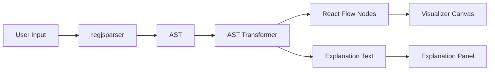

# Regex Visualizer MVP Implementation Plan

## Current Implementation Status

### ✅ Completed Features

- **Core Parser Integration**: Regex parsing with error handling using regjsparser
- **AST to Flow Transformer**: Converts AST to React Flow nodes with dynamic spacing to prevent overlap
- **AST to Explanation Transformer**: Converts AST nodes to human-readable explanations
- **State Management**: Zustand store managing regex input, AST, test strings, and UI state
- **Editor Pane**: Regex input with real-time parsing and error display
- **Visualizer Canvas**: React Flow visualization with custom nodes, pan/zoom, minimap
- **Explanation Panel**: Contextual slide-out panel that appears on node click
- **Sandbox Pane**: Basic string testing with Safe/Denied inputs and visual feedback
- **Phase 3 – Enhanced Sandbox Testing**: Match highlighting via `matchAll()`, visual highlight display and match details (positions, groups), paste to Safe/Denied, plain-text file upload (one line = one entity), batch test list with match/no-match; Denied shows “No matches – correctly rejected” when regex correctly rejects
- **Dark Mode UI**: Professional dark theme with Linear.app aesthetic
- **Custom Node Components**: StartNode, MatchNode, LoopNode, GroupNode, AlternationNode, EndNode

### 🚧 Future Roadmap

#### Phase 4: Step-by-step Debugging (Not Implemented)

- **Interactive Debugging**: Allow users to click through the string character by character
- **Real-time Matching**: Show which part of the regex is matching at each position
- **Visual Feedback**: Highlight the current matching state in the flow diagram
- **Step Controls**: Previous/Next buttons to navigate through the matching process

## Architecture Overview

The application follows a unidirectional data flow: **User Input → Parser → AST → Transformer → React Flow Nodes/Edges → Renderer**.



## File Structure

```
app/
  page.tsx                    # Main layout with split pane
  layout.tsx                  # Root layout
  globals.css                 # Global styles with dark theme
lib/
  parser/
    regexParser.ts            # Wrapper around regjsparser
    astTypes.ts               # TypeScript types for AST nodes
  transformer/
    astToFlow.ts              # Converts AST to React Flow nodes/edges with dynamic spacing
    astToExplanation.ts       # Converts AST to human-readable text
  store/
    useRegexStore.ts          # Zustand store for regex state
components/
  EditorPane.tsx              # Regex input editor with error display
  SandboxPane.tsx             # Testing pane: Safe/Denied, match highlight, match details, paste, file upload
  VisualizerCanvas.tsx        # React Flow canvas with custom nodes, minimap, pan/zoom
  ExplanationPanel.tsx        # Contextual explanation panel (slide-out/overlay)
  nodes/
    StartNode.tsx             # Custom React Flow node: Start state
    MatchNode.tsx             # Custom React Flow node: Character/pattern match
    LoopNode.tsx              # Custom React Flow node: Quantifiers (*, +, ?)
    GroupNode.tsx             # Custom React Flow node: Capturing groups
    AlternationNode.tsx       # Custom React Flow node: Alternation (|)
    EndNode.tsx               # Custom React Flow node: End state
```

## Implementation Details

### 1. Core Parser Integration (`lib/parser/`)

- `**regexParser.ts**`: ✅ Wraps `regjsparser` to parse regex strings into AST. Handles invalid regex gracefully with try-catch.
- `**astTypes.ts**`: ✅ Defines TypeScript interfaces for common AST node types (CharacterClass, Quantifier, Group, Alternation, etc.) based on regjsparser's output structure.

### 2. AST to Flow Transformer (`lib/transformer/astToFlow.ts`)

✅ **Implemented**: Recursively traverses the AST and generates:

- **Nodes**: Each significant regex element becomes a node (start, character classes, groups, quantifiers, end)
- **Edges**: Connections between nodes representing the flow of matching
- **Layout**: Uses dynamic spacing based on label width to prevent node overlap
- **AST Node Storage**: Stores AST nodes directly on flow nodes for efficient explanation lookup

Key transformations:

- `CharacterClass` → `MatchNode` with character range display
- `Quantifier` (, +, ?, {n,m}) → `LoopNode` with quantifier info
- `Group` → `GroupNode` with group number/name
- `Alternation` (|) → Branching edges with proper vertical spacing

### 3. AST to Explanation Transformer (`lib/transformer/astToExplanation.ts`)

✅ **Implemented**: Converts AST nodes to plain English explanations:

- "Matches one or more lowercase letters, numbers, underscores, dots, or hyphens"
- "Captures group 1: ..."
- "Matches between 2 and 6 lowercase letters or dots"
- Supports direct AST node lookup via `getExplanationFromAstNode()`

### 4. State Management (`lib/store/useRegexStore.ts`)

✅ **Implemented**: Zustand store managing:

- `regexInput`: Raw regex string
- `safeString`: Test string that should match
- `deniedString`: Test string that should not match
- `ast`: Parsed AST or null
- `selectedNodeId`: Currently selected/hovered node ID
- `selectedEditorRange`: Currently selected text range in editor
- `explanationNodeId`: Node ID for which explanation panel should show
- `explanationAstNode`: AST node for direct explanation lookup (fixes ID mismatch issue)
- `error`: Parsing error message if any
- `batchTestStrings`: Lines from uploaded plain-text file (one line = one test entity)
- Actions: `setRegexInput()`, `setSafeString()`, `setDeniedString()`, `setBatchTestStrings()`, `clearBatchTestStrings()`, `parseRegex()`, `testMatch()`, `testMatchAll()`, `setSelectedNode()`, `setExplanationNode()`

### 5. UI Components

- `**EditorPane.tsx`: ✅ Textarea with error display. Shows validation errors inline. Debounced input for performance.
- `**SandboxPane.tsx`: ✅ Two textareas (Safe/Denied) with real-time match testing. Uses `testMatch()` and `testMatchAll()`: green glow on Safe matches, red warning when Denied matches (should not). Match highlight block shows full string with all matches highlighted in green; match details panel lists each match (index, [start,end), captured groups). Paste to Safe / Paste to Denied buttons; plain-text file upload (one line = one entity) with batch list (click line to use as Safe). Denied shows “No matches – correctly rejected” when regex correctly rejects.
- `**VisualizerCanvas.tsx`: ✅ React Flow canvas with:
  - Custom node components for different regex elements
  - Pan/zoom controls (styled for dark theme)
  - Minimap in bottom-right corner
  - Auto-layout on AST changes with dynamic spacing
  - Node click handlers to show explanation panel
  - Hover/selection state
  - Hint overlay when no explanation is open
- `**ExplanationPanel.tsx`: ✅ Contextual slide-out panel (right side) that appears when a node is clicked. Shows detailed explanation of that specific regex element. Uses AST node directly for lookup. Can be dismissed.
- **Custom Nodes**: ✅ React Flow node components styled with Tailwind dark mode, showing regex element details. Support hover/selected states. Includes: StartNode, MatchNode, LoopNode, GroupNode, AlternationNode, EndNode.

### 6. Main Layout (`app/page.tsx`)

✅ **Implemented**: T-shape split layout:

- **Left column (30% width)**:
  - **Top half**: EditorPane (regex input)
  - **Bottom half**: SandboxPane (Safe/Denied testing)
- **Right column (70% width)**: VisualizerCanvas (full height)
- **Overlay/Slide-out**: ExplanationPanel (appears on node click, slides in from right, adjusts canvas margin)

## Technical Considerations

- **Error Handling**: ✅ Invalid regex patterns show error messages in editor. Sandbox handles invalid regex gracefully.
- **Performance**: ✅ Debounce regex parsing to avoid re-parsing on every keystroke. Debounce sandbox testing as well.
- **Node Spacing**: ✅ Dynamic spacing based on label width prevents overlap. Calculates node width and spacing automatically.
- **Dark Mode**: ✅ Configured Tailwind with dark mode by default. Uses Tokyo Night inspired color palette. Linear.app aesthetic (1px borders, subtle rounded corners).
- **Minimap**: ✅ React Flow's built-in minimap component with custom styling.
- **Accessibility**: Proper ARIA labels for interactive elements, keyboard navigation support
- **Responsive**: On small screens, stack panes vertically instead of side-by-side

## Dependencies Installed

- `@xyflow/react` (React Flow) ✅
- `regjsparser` (Regex parser) ✅
- `zustand` (State management) ✅
- `tailwindcss` (Styling) ✅
- `next` (Framework) ✅
- `use-debounce` (Debouncing) ✅

## UX Enhancements Implemented

- ✅ **Success/Error Feedback**: Sandbox shows green glow for successful Safe matches, red indicators for Denied matches
- ✅ **Minimap**: Small navigational minimap in visualizer corner for large regex patterns
- ✅ **Contextual Explanation**: Click any node to see detailed explanation without losing visual context
- ✅ **Dark Mode**: Professional dark theme with Tokyo Night/Catppuccin palette
- ✅ **Linear.app Aesthetic**: Thin borders (1px), subtle rounded corners, clean spacing
- ✅ **Visual Hints**: Hint overlay appears when no explanation is open to guide users
- ✅ **Dynamic Layout**: Nodes automatically space themselves to prevent overlap

## Future Enhancements (Roadmap)

### Phase 3: Enhanced Sandbox Testing ✅ (Done)

- Match highlighting via `matchAll()`, visual highlight and match details, paste to Safe/Denied, plain-text file upload (one line = one entity), batch list, Denied “correctly rejected” state.

### Phase 4: Step-by-step Debugging ✅ (Done)

- **Interactive Debugging**: Click through the string character by character
- **Real-time Matching**: Show which part of the regex is matching at each position
- **Visual Feedback**: Highlight the current matching state in the flow diagram
- **Step Controls**: Previous/Next buttons to navigate through the matching process
- **State Visualization**: Show the current state of the regex engine at each step

### Phase 5: ReDoS & Performance Evil Patterns (Next)

- **ReDoS detection**: Static analysis on the parsed regex AST to detect patterns that can cause catastrophic backtracking (Regular expression Denial of Service).
- **Evil pattern warnings**: Identify and flag dangerous constructs (e.g. nested quantifiers like `(a+)+`, `(a*)`, overlapping alternation, repeated patterns that can match the same text in many ways).
- **UI integration**: Surface warnings in the editor pane or explanation panel (e.g. “⚠️ Possible ReDoS / performance risk”) when dangerous shapes are detected.
- **Educational value**: Help users understand which constructs are risky and why; optionally link to short explanation or safe alternatives.
- **Implementation approach**: Use existing AST from regjsparser; add a ReDoS heuristics pass (or integrate a library such as `safe-regex` or `regexp-tree` with ReDoS detection) and display results in the UI.

### Other Future Enhancements

- Cross-highlighting between editor and visualizer nodes on hover/selection
- Export/sharing functionality
- Regex pattern library/templates
- Performance optimizations for very large regex patterns
